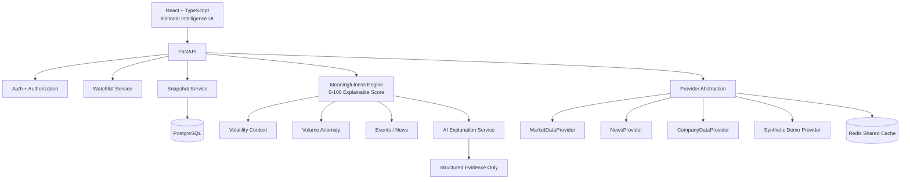

# Market Memory Architecture

```mermaid
flowchart TD
  UI[React + TypeScript\nEditorial Intelligence UI] --> API[FastAPI]
  API --> AUTH[Auth + Authorization]
  API --> WL[Watchlist Service]
  API --> SNAP[Snapshot Service]
  SNAP --> DB[(PostgreSQL)]
  API --> ENGINE[Meaningfulness Engine\n0-100 Explainable Score]
  ENGINE --> VOL[Volatility Context]
  ENGINE --> VOLUME[Volume Anomaly]
  ENGINE --> EVENTS[Events / News]
  ENGINE --> AI[AI Explanation Service]
  AI --> EVIDENCE[Structured Evidence Only]
  API --> PROVIDERS[Provider Abstraction]
  PROVIDERS --> MARKET[MarketDataProvider]
  PROVIDERS --> NEWS[NewsProvider]
  PROVIDERS --> COMPANY[CompanyDataProvider]
  PROVIDERS --> SYNTH[Synthetic Demo Provider]
  PROVIDERS --> CACHE[(Redis Shared Cache)]
```

## Critical invariant

The LLM is downstream of deterministic event detection. It receives evidence and explains it; it does not decide what happened in the market.
